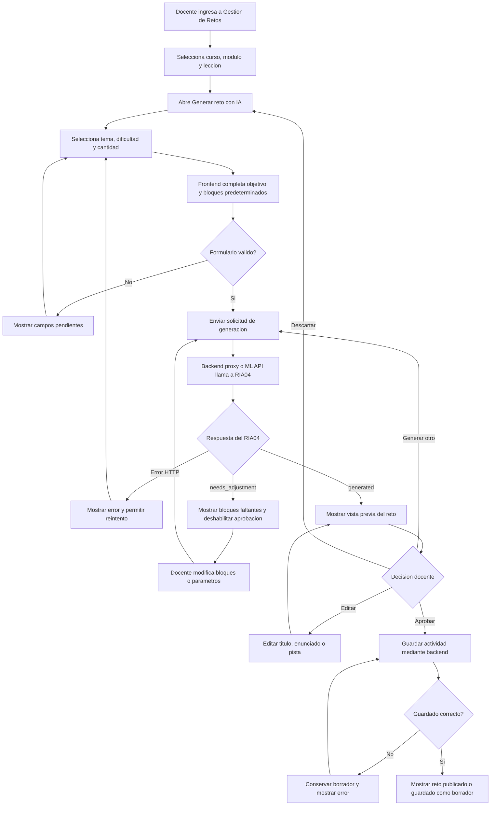

# Guia de implementacion frontend - RIA04 Generador de retos

## 1. Objetivo

Esta guia describe como integrar en la vista del docente el RIA04 implementado
en `data-science`. El RIA04 genera borradores de retos de logica de
programacion y robotica a partir de parametros definidos por el docente.

El generador no publica actividades automaticamente. El flujo esperado es:

1. El docente configura la solicitud.
2. RIA04 genera uno o mas borradores.
3. El frontend presenta la vista previa y las validaciones.
4. El docente revisa, edita y aprueba el reto.
5. El reto aprobado se guarda como actividad mediante el backend.

## 2. Estado actual y dependencias

RIA04 se encuentra implementado en el modulo `data-science`.

- Endpoint disponible en ML API: `POST /ria04/generate`.
- Endpoint de informacion: `GET /ria04/info`.
- Archivo principal: `app/adapters/ml_models/ria04_generador.py`.
- El frontend actual usa `frontend/src/infrastructure/api/axiosInstance.ts` y
  dirige sus solicitudes a `/api/v1/` del backend.
- El frontend no tiene todavia un cliente separado para ML API.
- El DTO actual `ActivityRequestDTO` solo contiene `id_lesson` y `name`; por
  tanto, todavia no permite persistir en el backend todo el contenido generado.

La pantalla puede implementar la generacion y previsualizacion inmediatamente.
Para publicar el reto completo se necesita primero ampliar el contrato de
actividad del backend o crear un endpoint especifico para retos generados.

## 3. Ubicacion recomendada en la interfaz

La integracion debe realizarse desde la vista existente:

`frontend/src/ui/pages/DocenteRetosPage.tsx`

Ruta actual:

`/docente/retos`

Se recomienda agregar un boton principal llamado `GENERAR RETO CON IA` junto al
boton de creacion manual. El generador debe abrirse en un modal o panel lateral,
sin reemplazar la creacion manual de actividades.

Cuando sea posible, el docente debe ingresar al generador desde el contexto de
un curso, modulo y leccion previamente seleccionados. De esa manera el sistema
sabe donde guardar el reto cuando sea aprobado.

## 4. Flujograma de uso



## 5. Formulario minimo

Para el PMV se recomienda mostrar solo cuatro campos:

| Campo | Componente | Obligatorio | Valor inicial |
| --- | --- | --- | --- |
| Tema | Lista desplegable | Si | `loops` |
| Dificultad | Lista desplegable | Si | `basic` |
| Objetivo de aprendizaje | Texto autocompletado y editable | Si | Segun el tema |
| Cantidad | Lista desplegable | Si | `1` |

Opciones de tema:

| Etiqueta visible | Valor enviado |
| --- | --- |
| Secuencias | `sequences` |
| Ciclos | `loops` |
| Condicionales | `conditionals` |
| Variables | `variables` |

Opciones de dificultad:

| Etiqueta visible | Valor enviado |
| --- | --- |
| Basica | `basic` |
| Intermedia | `intermediate` |
| Avanzada | `advanced` |

La cantidad deberia limitarse inicialmente a 1, 2 o 3 retos, aunque la API
acepta hasta 5.

## 6. Configuracion avanzada

Los siguientes campos deben permanecer dentro de una seccion colapsable:

- Bloques permitidos: seleccion multiple.
- Restricciones: casillas o etiquetas editables.
- Semilla: oculta para el usuario normal; util solamente para reproducir una
  generacion durante pruebas.

Valores predeterminados sugeridos:

| Tema | Bloques predeterminados |
| --- | --- |
| Secuencias | `move_forward`, `turn_left`, `turn_right` |
| Ciclos | `repeat`, `move_forward`, `turn_right` |
| Condicionales | `if`, `obstacle_ahead`, `move_forward`, `turn_right` |
| Variables | `set_variable`, `change_variable`, `repeat`, `move_forward` |

El frontend debe enviar los identificadores tecnicos en ingles. En la interfaz
se deben presentar etiquetas en espanol.

## 7. Contrato de entrada

```ts
export type Ria04Difficulty = "basic" | "intermediate" | "advanced";

export interface Ria04GenerateRequest {
  topic: string;
  learning_objective: string;
  difficulty: Ria04Difficulty;
  allowed_blocks: string[];
  constraints: string[];
  quantity: number;
  seed?: number | null;
}
```

Ejemplo:

```json
{
  "topic": "loops",
  "learning_objective": "Utilizar ciclos para controlar el movimiento de un robot",
  "difficulty": "basic",
  "allowed_blocks": ["repeat", "move_forward"],
  "constraints": ["usar un solo ciclo"],
  "quantity": 1,
  "seed": null
}
```

## 8. Contrato de respuesta

```ts
export interface Ria04TestCase {
  [key: string]: unknown;
}

export interface Ria04Validation {
  schema_valid: boolean;
  block_compatibility: boolean;
  missing_blocks: string[];
  deterministic_tests_available: boolean;
  status: "ready_for_teacher_review" | "needs_block_adjustment";
}

export interface Ria04Challenge {
  challenge_id: string;
  title: string;
  topic: string;
  learning_objective: string;
  difficulty: Ria04Difficulty;
  statement: string;
  hint: string;
  allowed_blocks: string[];
  required_blocks: string[];
  constraints: string[];
  expected_solution: unknown[];
  test_cases: Ria04TestCase[];
  validation: Ria04Validation;
}

export interface Ria04GenerateResponse {
  result: "generated" | "needs_adjustment";
  accuracy: null;
  precision: null;
  details: {
    technique: "sistema_experto_y_generacion_procedural_controlada";
    challenges: Ria04Challenge[];
    operational_metrics: {
      requested_challenges: number;
      generated_challenges: number;
      format_valid_rate: number;
      block_compatibility_rate: number;
      teacher_review_required: true;
    };
  };
}
```

RIA04 no es un clasificador. El frontend no debe mostrar `accuracy` ni
`precision`; ambos campos se mantienen en `null` solo por compatibilidad con el
contrato general de predicciones.

## 9. Estrategia de conexion

### Opcion recomendada: backend como proxy

Para produccion, el frontend no debe acceder directamente a ML API. El flujo
recomendado es:

```text
Frontend -> Backend autenticado -> ML API interna -> RIA04
```

El backend deberia exponer un endpoint como:

```text
POST /api/v1/ai/ria04/generate
```

El backend valida que el usuario sea docente y reenvia la solicitud al servicio
interno:

```text
POST http://ml-ia:8000/ria04/generate
```

Con este enfoque el frontend puede reutilizar `axiosInstance`, el token y el
tratamiento normal de errores.

Importante: `/api/v1/ai/ria04/generate` es una ruta propuesta y todavia debe ser
implementada en el backend.

### Opcion temporal: acceso directo a ML API

Solo para desarrollo local se puede crear una instancia Axios independiente con
una variable como `VITE_ML_API_URL` y llamar a `/ria04/generate`.

No se debe usar el `axiosInstance` actual para llamar directamente al RIA04,
porque su `baseURL` apunta al backend y agrega el contexto `/api/v1/`.

El acceso directo no es recomendable en produccion porque el endpoint de ML no
implementa por si mismo autorizacion de docente.

## 10. Organizacion sugerida en el frontend

No es obligatorio usar exactamente estos nombres, pero deben respetarse las
capas existentes del proyecto:

```text
frontend/src/
  shared/types/Ria04.ts
  infrastructure/api/services/ria04Service.ts
  application/hooks/useRia04Generator.ts
  ui/components/Docente/Ria04GeneratorModal.tsx
  ui/components/Docente/Ria04ChallengePreview.tsx
  ui/pages/DocenteRetosPage.tsx
```

Responsabilidades:

- `Ria04.ts`: contratos TypeScript de entrada y respuesta.
- `ria04Service.ts`: llamada HTTP al backend proxy o a ML API durante desarrollo.
- `useRia04Generator.ts`: estados de carga, resultado, error, reintento y
  descarte.
- `Ria04GeneratorModal.tsx`: formulario del docente.
- `Ria04ChallengePreview.tsx`: visualizacion, validaciones y acciones del reto.
- `DocenteRetosPage.tsx`: apertura del modal y asociacion con curso, modulo y
  leccion.

## 11. Estados que debe manejar la vista

```ts
type GeneratorState =
  | "idle"
  | "editing"
  | "generating"
  | "preview"
  | "needs_adjustment"
  | "saving"
  | "saved"
  | "error";
```

Comportamiento esperado:

- `generating`: deshabilitar el formulario y mostrar indicador de carga.
- `preview`: mostrar los retos y habilitar edicion, regeneracion y aprobacion.
- `needs_adjustment`: mostrar `missing_blocks` y deshabilitar `Aprobar`.
- `saving`: evitar dobles envios.
- `error`: conservar el formulario y el borrador para permitir reintento.

## 12. Vista previa del reto

Cada tarjeta debe mostrar:

- Titulo.
- Tema y dificultad.
- Enunciado.
- Pista.
- Bloques permitidos.
- Restricciones.
- Estado de validacion.

La solucion esperada y los casos de prueba son informacion del docente. No
deben mostrarse posteriormente al estudiante.

Indicadores sugeridos:

- Verde: formato valido.
- Verde: bloques compatibles.
- Verde: casos de prueba disponibles.
- Naranja: faltan bloques o se necesita un ajuste.
- Etiqueta permanente: pendiente de revision docente.

Acciones:

- `Editar`.
- `Generar otro`.
- `Descartar`.
- `Aprobar reto`.

## 13. Persistencia del reto aprobado

El contrato actual del backend permite crear una actividad con:

```ts
export interface ActivityRequestDTO {
  id_lesson: string;
  name: string;
}
```

Este contrato no puede guardar el enunciado, la pista, los bloques ni los casos
de prueba. Antes de habilitar la publicacion definitiva se requiere una de estas
dos soluciones:

1. Ampliar `ActivityRequestDTO` y la entidad de actividad.
2. Crear una entidad y endpoint especificos para retos de programacion.

Contrato de persistencia sugerido:

```ts
export interface GeneratedChallengeRequestDTO {
  id_lesson: string;
  title: string;
  topic: string;
  difficulty: Ria04Difficulty;
  learning_objective: string;
  statement: string;
  hint: string;
  allowed_blocks: string[];
  required_blocks: string[];
  constraints: string[];
  expected_solution: unknown[];
  test_cases: Ria04TestCase[];
  source: "RIA04";
  publication_status: "DRAFT" | "PUBLISHED";
}
```

Hasta que este contrato exista, el frontend debe tratar el resultado como una
vista previa y no comunicar al usuario que el reto ya fue publicado.

## 14. Validaciones frontend

Antes de invocar RIA04:

- `topic` no puede estar vacio.
- `learning_objective` no puede estar vacio.
- `difficulty` debe ser uno de los tres valores admitidos.
- `quantity` debe estar entre 1 y 3 para el PMV.
- Los bloques enviados deben pertenecer al catalogo del simulador.
- El curso, modulo y leccion deben estar seleccionados si se pretende guardar.

Despues de recibir la respuesta:

- Verificar que exista al menos un reto.
- Si `result` es `needs_adjustment`, mostrar los bloques faltantes.
- No habilitar aprobacion si `block_compatibility` es `false`.
- No mostrar la solucion esperada en ninguna vista del estudiante.

## 15. Manejo de errores

| Situacion | Mensaje sugerido |
| --- | --- |
| API no disponible | No fue posible generar el reto. Intenta nuevamente. |
| Solicitud invalida | Revisa los datos seleccionados. |
| Bloques incompatibles | El reto necesita bloques que no estan permitidos. |
| Respuesta sin retos | No se genero ningun reto. Cambia los parametros. |
| Error al guardar | El reto se conserva como borrador, pero no pudo guardarse. |

No se deben mostrar trazas, nombres de clases Python ni mensajes internos del
servidor al docente.

## 16. Criterios de aceptacion frontend

1. Solo un usuario con rol docente puede abrir el generador.
2. El docente puede generar un reto usando tema, dificultad, objetivo y cantidad.
3. La interfaz conserva los datos mientras se procesa la solicitud.
4. Un resultado `generated` muestra una vista previa completa.
5. Un resultado `needs_adjustment` informa los bloques faltantes.
6. No se puede aprobar un reto con bloques incompatibles.
7. El docente puede editar el contenido antes de aprobarlo.
8. La solucion y los casos de prueba nunca se muestran al estudiante.
9. Un error de red no elimina el formulario ni el borrador generado.
10. La interfaz no muestra `accuracy` ni `precision` para RIA04.

## 17. Pruebas frontend recomendadas

- Render del formulario con valores predeterminados.
- Cambio de tema actualiza objetivo y bloques sugeridos.
- Envio correcto del payload.
- Estado de carga durante la generacion.
- Render de uno y varios retos.
- Render de `missing_blocks` cuando se recibe `needs_adjustment`.
- Boton de aprobacion deshabilitado para retos incompatibles.
- Conservacion del borrador ante error al guardar.
- Ocultamiento de solucion y casos de prueba en la vista del estudiante.

## 18. Resumen del caso de uso de IA

Entradas: tema de programacion, objetivo de aprendizaje, dificultad seleccionada
por el docente, bloques permitidos, restricciones y cantidad de retos.

Tecnica o modelo IA: sistema experto basado en reglas pedagogicas y generacion
procedural controlada mediante plantillas.

Outputs: borradores de retos con titulo, enunciado, pista, bloques requeridos,
solucion esperada, casos de prueba y resultado de validacion.

Medidas del sistema: porcentaje de retos con formato valido, compatibilidad de
bloques, disponibilidad de casos de prueba ejecutables y porcentaje de retos
aprobados por el docente.
