# RIA07 - Análisis de patrones estudiantiles

## Alineación con el informe

El informe define RIA07 con trazabilidad `CU-AN-03`:

| Elemento | Definición implementada |
| --- | --- |
| Entradas | Logs del simulador resumidos en frecuencia, duración y días de inactividad. |
| Técnica | Clustering K-means con escalado robusto y selección del número de segmentos mediante separación, estabilidad, equilibrio y simplicidad. |
| Salida | Segmento del estudiante, explicación del patrón y sugerencia para el docente. |
| Medidas | Frecuencia de actividades, duración promedio de sesión y continuidad. |

El documento menciona “exactitud 75%”, pero accuracy no es una métrica válida
para clustering sin segmentos reales etiquetados. RIA07 devuelve silhouette,
Davies-Bouldin, Calinski-Harabasz y estabilidad ARI. Solo se podrá calcular
accuracy externa cuando exista una clasificación de referencia validada por
especialistas.

## Datos usados en la primera versión

El dataset actual no contiene eventos individuales. Contiene resúmenes
comparables por estudiante:

- `actividades_completadas` se acepta como alias heredado de
  `frecuencia_actividad` únicamente porque el dataset actual declara una fila
  agregada por estudiante.
- `tiempo_sesion_min` se acepta como alias heredado de
  `duracion_promedio_min` bajo el mismo contrato de resumen.
- `dias_inactivo` mide la continuidad reciente del estudiante.
- Los bloques son el único medio de interacción del simulador; por eso
  `uso_bloques` no se usa para crear grupos.
- `uso_codigo` se conserva solamente para describir y auditar la cohorte
  durante el entrenamiento. No forma parte de las variables de K-means, no
  cambia los segmentos y no se solicita al predecir.

Esta separación evita crear segmentos como “uso frecuente de bloques”, que no
aportan información porque todos los estudiantes usan el mismo medio. Los
grupos resultantes describen el ritmo de participación: sesiones breves,
sesiones prolongadas, continuidad o interrupciones.

Cuando existan logs reales, el backend debe agregarlos para una misma ventana
de observación antes de llamar al servicio. No deben compararse frecuencias
calculadas sobre periodos diferentes.

La duración y unidad exacta de esa ventana todavía es una decisión pendiente
del proyecto. RIA07 no inventa ese periodo: registra una advertencia mientras
no se entreguen `fecha_inicio_ventana`, `fecha_fin_ventana` y `fecha_corte`.
Cuando las fechas existen, comprueba que no haya eventos posteriores al corte
y que toda la cohorte use periodos compatibles.

## Controles de confiabilidad

- El entrenamiento es transaccional: un fallo conserva el modelo anterior.
- Las variables constantes o casi constantes se excluyen; deben quedar al
  menos dos variables informativas.
- La estabilidad usa 10 submuestras reproducibles del 80% y compara con ARI
  las observaciones comunes.
- El balance se evalúa mediante entropía y un tamaño mínimo obligatorio por
  segmento. Los candidatos inválidos no pueden ser seleccionados.
- Las métricas internas sin redondear seleccionan el modelo; el redondeo se
  aplica solamente al reporte.
- La comparación con el segmento usa Q1 y Q3 reales, no un porcentaje
  arbitrario del centroide.
- Una asignación requiere revisión si la calidad global es débil, la
  tipicidad es baja, el margen entre los dos centroides es pequeño, el
  segmento es muy pequeño o el registro está fuera de distribución.
- Con calidad débil se muestra únicamente el patrón más cercano y se
  recomienda revisar los datos y reentrenar.

## Flujo

```mermaid
flowchart LR
    A["Logs de actividades"] --> B["Backend agrega una ventana común"]
    B --> C["Frecuencia, duración media y días inactivo"]
    C --> D["POST /ria07/patterns o /batch"]
    D --> E["Validación: código no se solicita"]
    E --> F["Validación de cohorte y variables informativas"]
    F --> G["K-means y estabilidad por submuestreo"]
    G --> H["Margen, tipicidad y revisión"]
    H --> I["Tabla para el docente"]
```



## Endpoints

### Analizar un estudiante

`POST /ria07/patterns`

```json
{
  "student_id": "ALUM-001",
  "student_name": "Estudiante 1",
  "activity_frequency": 12,
  "average_session_minutes": 32,
  "inactive_days": 4
}
```

La respuesta contiene:

- `segment_id`, `segment_name` y `segment_description`.
- `segment_uid`, `model_run_id`, `model_version`, `trained_at`,
  `raw_cluster` y `profile_key` para asociar el resultado con el entrenamiento
  exacto. `segment_id` es local a esa ejecución y no debe tratarse como un
  identificador global permanente.
- `assignment_typicality`: posición relativa de la distancia al centro dentro
  del segmento. No es probabilidad.
- `assignment_margin`, `assignment_ambiguous`,
  `nearest_cluster_distance` y `second_cluster_distance`.
- `segment_sample_size`, `typicality_reference_size`,
  `typicality_method` y advertencia de muestra pequeña.
- `out_of_distribution`, `review_reasons` y `requires_review`.
- `assignment_interpretation`: explicación sencilla para el docente, por
  ejemplo “Muy representativo del grupo” o “Coincidencia parcial”.
- `teacher_summary`: resumen del resultado en una sola frase.
- `reasons`: señales altas o bajas frente a la cohorte.
- `segment_comparison`: conserva los valores técnicos, pero también incluye una
  frase completa por indicador para mostrar al docente.
- `teacher_suggestion`: título, prioridad y acciones.
- `model_quality`: métricas globales y una interpretación en lenguaje sencillo.
- `technical_details.feature_contributions`: indica qué variables
  contribuyeron a la distancia, sin presentarlas como causas.
- `training_period`: periodo temporal auditado o advertencia de que el origen
  no proporcionó fechas.

La selección combina silhouette, estabilidad ARI por submuestreo, entropía de
tamaños y una penalización por complejidad. Cada candidato informa tamaños,
porcentajes, penalizaciones, score interno y razón de aceptación o descarte.

### Analizar un grupo

`POST /ria07/patterns/batch`

```json
{
  "students": [
    {
      "student_id": "ALUM-001",
      "activity_frequency": 12,
      "average_session_minutes": 32,
      "inactive_days": 4
    },
    {
      "student_id": "ALUM-002",
      "activity_frequency": 3,
      "average_session_minutes": 11,
      "inactive_days": 8
    }
  ]
}
```

Devuelve conteos por segmento, perfiles de la cohorte y una fila explicable
por estudiante.

### Información del modelo

`GET /ria07/info`

Expone versión, técnica, variables, calidad, perfiles, candidatos evaluados,
`model_run_id`, periodo, diagnósticos y advertencias. También incluye
`training_only_code_usage`, que declara explícitamente
`used_for_segmentation: false` y `used_for_prediction: false`.

## Vista sugerida para el docente

La opción más clara es una tabla filtrable:

| Estudiante | Segmento | Frecuencia | Duración | Días inactivo | Tipicidad | Prioridad | Acción |
| --- | --- | ---: | ---: | ---: | ---: | --- | --- |
| ALUM-001 | Sesiones breves y regulares | 12 | 24 min | 2 | 81% | Baja | Consolidar entre sesiones |

Sobre la tabla deben mostrarse:

- cantidad y porcentaje de estudiantes por segmento;
- estado de calidad del clustering;
- descripción de cada segmento;
- advertencia visible de que el segmento no es una calificación ni un
  diagnóstico.

Al seleccionar una fila, un panel lateral puede mostrar razones, comparación
con el centro del segmento y acciones sugeridas.

La vista local muestra solo cuatro bloques para el docente: resumen, motivos
principales, acción recomendada y aviso. Las métricas y comparaciones completas
permanecen disponibles en el API para revisión técnica.

## Reentrenamiento y compatibilidad

El artefacto se guarda como `saved_models/ria07_patrones_model.pkl`. La API y
la UI local verifican `model_version` y el esquema de variables. La versión
actual es `ria07-v5-reliable`. Un modelo ausente o incompatible se vuelve a
entrenar con el dataset configurado.

La clase también ofrece `save(path)` y `load(path, trusted=True)`. Joblib usa
deserialización basada en pickle: nunca debe cargarse un artefacto recibido de
una fuente no confiable.

## Limitaciones

- La primera versión usa resúmenes sintéticos y no logs de eventos reales.
- La unidad temporal de `frecuencia_actividad` debe acordarse con backend y
  producto. Hasta entonces se conserva el contrato del dataset agregado y se
  emite una advertencia de trazabilidad temporal.
- La diversidad de bloques aún no puede medirse porque el dataset no registra
  categorías de bloques. Cuando existan logs detallados, podrá añadirse esa
  medida sin comparar bloques contra código.
- Los nombres de los segmentos son interpretaciones pedagógicas de centroides,
  no etiquetas verdaderas.
- Un silhouette moderado permite exploración, pero los segmentos deben
  validarse con docentes antes de usarse para decisiones automáticas.
- RIA07 debe apoyar la observación docente y nunca sancionar o calificar por sí
  solo.
