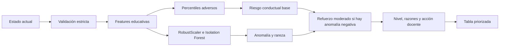

# Guía de implementación de RIA08: riesgo y anomalías

## 1. Alcance correcto

RIA08 unifica alertas de riesgo educativo y detección de comportamientos
atípicos para apoyar al docente.

Esta versión no necesita una secuencia temporal individual del estudiante. Sí
necesita una cohorte de referencia para:

- ajustar `RobustScaler`;
- entrenar `IsolationForest`;
- calcular percentiles y umbrales relativos;
- comparar el estado actual con el grupo.

`risk_score` es un índice heurístico de atención entre 0 y 100. No es una
probabilidad de abandono. `anomaly_score` es un percentil de rareza y tampoco
es una probabilidad. La rareza no implica automáticamente riesgo educativo.

## 2. Flujo



## 3. Entrada y validación

| Campo API | Escala | Obligatorio | Regla |
| --- | --- | --- | --- |
| `student_id` | texto | No | Metadato, nunca feature. |
| `student_name` | texto | No | Metadato, nunca feature. |
| `attempts` | entero >= 0 | Sí | Si es 0, `errors` también debe ser 0. |
| `errors` | entero >= 0 | Sí | Puede superar intentos porque un intento puede registrar varios errores. |
| `score` | 0 a 100 | Sí | No se recorta automáticamente. |
| `inactive_days` | entero >= 0 | Sí | No se corrigen negativos. |
| `completed_activities` | entero >= 0 | Sí | Estado actual. |
| `success_rate` | 0 a 1 | No | Si falta, se deriva explícitamente como `score / 100`. |
| `help_requested` | entero >= 0 | Sí | Estado actual. |

El modelo rechaza columnas obligatorias ausentes, textos no numéricos,
infinitos, valores negativos, conteos decimales y escalas inválidas. Los
mensajes identifican la columna y los índices afectados.

La conversión de porcentajes 0-100 a tasa 0-1 debe hacerse antes de llamar a
RIA08. El modelo no infiere escalas ambiguas.

## 4. Features

El archivo principal es
`app/adapters/ml_models/ria08_riesgo_anomalias.py`.

Features disponibles para validación y explicación:

- intentos, errores, puntaje, días inactivo;
- actividades completadas, tasa de éxito y ayuda solicitada;
- errores por intento y ayuda por intento;
- brecha entre `score / 100` y `success_rate`.

Features entregadas a `IsolationForest`:

- intentos;
- puntaje y tasa de éxito por separado;
- días inactivo;
- actividades completadas;
- errores por intento;
- ayuda por intento;
- brecha de rendimiento.

Los conteos absolutos de errores y ayuda se conservan como evidencia, pero no
entran simultáneamente al detector con sus cocientes. Esto reduce la
sobrerrepresentación de la misma señal. El entrenamiento genera un reporte de
pares con correlación absoluta igual o superior a 0.85 para revisión.

## 5. Percentiles y variables constantes

Los empates usan el promedio entre la posición izquierda y derecha. Si una
variable es constante en la cohorte, aporta exactamente cero riesgo. Esto evita
razones incorrectas como “0 días sin actividad” o “0 errores por intento”.

Los umbrales relativos de los percentiles 15 y 85 sí se utilizan para generar
razones, junto con límites absolutos mínimos. Una razón requiere simultáneamente:

1. percentil adverso suficiente;
2. cruce del umbral relativo de la cohorte;
3. cruce de un límite absoluto con significado educativo básico;
4. variación real de la feature en la cohorte.

## 6. Riesgo y anomalía

El riesgo base es la suma ponderada de percentiles educativos adversos. Los
pesos son configurados manualmente y no son importancias aprendidas por
`IsolationForest`.

La anomalía solamente refuerza el riesgo cuando:

- `IsolationForest` marca el registro como anómalo;
- existe por lo menos una señal adversa verificable;
- el riesgo conductual supera el mínimo configurado.

La fórmula del refuerzo es:

```text
boost = anomaly_weight * anomaly_score * (behavioral_score / 100)
risk_score = min(100, behavioral_score + boost)
```

Una anomalía positiva, como rendimiento excepcionalmente alto, no recibe
refuerzo y permanece en nivel normal si no tiene señales adversas.

Los límites predeterminados, configurables desde el constructor, son:

| Nivel | Regla inicial |
| --- | --- |
| Normal | Menor que 60 o sin evidencia adversa verificable. |
| Atención | Desde 60 y menor que 80. |
| Crítico | Desde 80. |

Estos límites no tienen validez clínica ni predictiva demostrada. Deben
calibrarse con docentes y casos revisados.

## 7. Endpoints

### Individual

`POST /ria08/early-warning`

```json
{
  "student_id": "123",
  "student_name": "Estudiante A",
  "attempts": 10,
  "errors": 12,
  "score": 45,
  "inactive_days": 14,
  "completed_activities": 2,
  "success_rate": 0.4,
  "help_requested": 6
}
```

La respuesta incluye `behavioral_score`, `anomaly_boost`, razones alineadas con
sus códigos, evidencia y recomendación docente.

Las banderas de procedencia son:

```json
{
  "historical_data_used": false,
  "student_history_used": false,
  "reference_cohort_used": true
}
```

`historical_data_used` se conserva por compatibilidad y significa que no se
usó historial temporal individual. No significa que el modelo funcione sin
cohorte de referencia.

`POST /ria08/anomaly` se mantiene como alias temporal del contrato individual.

### Lote docente

`POST /ria08/early-warning/batch`

```json
{
  "students": [
    {
      "student_id": "123",
      "student_name": "Estudiante A",
      "attempts": 10,
      "errors": 12,
      "score": 45,
      "inactive_days": 14,
      "completed_activities": 2,
      "success_rate": 0.4,
      "help_requested": 6
    }
  ]
}
```

`DetectorRiesgoAnomalias.predict_batch()` conserva el orden original por
defecto e incluye `source_index`. Puede solicitarse
`sort_by_risk=True`. El servicio del endpoint usa esa opción explícitamente
porque la tabla docente necesita prioridad descendente.

## 8. Vista docente

La UI local presenta:

| Estudiante | Riesgo | Anomalía | Evidencia | Acción docente |
| --- | --- | --- | --- | --- |
| Estudiante A | Crítico (84.2) | Sí | 14 días sin actividad | Contactar y acordar reincorporación |
| Estudiante B | Atención (65.0) | No | Errores por intento elevados | Revisar la próxima actividad |
| Estudiante C | Normal (18.0) | No | Sin razones adversas | Seguimiento habitual |

La gráfica de RIA08 se titula “Pesos heurísticos configurados del riesgo” para
evitar presentarlos como importancia aprendida.

## 9. Entrenamiento, estado y persistencia

- Mínimo predeterminado: 20 registros válidos.
- Menos de 50 registros genera una advertencia almacenada en el modelo.
- Variables constantes generan una advertencia y no aportan riesgo.
- `is_fitted` solamente cambia a `true` después de un entrenamiento completo.
- El entrenamiento utiliza objetos temporales para no dejar estado parcial.
- Versión del servicio: `ria08-risk-anomaly-v3.0`.
- Configuración interna: `ria08-risk-config-v3`.
- Archivo: `saved_models/ria08_riesgo_anomalias_model.pkl`.

El repositorio `JoblibModelRepository` guarda la instancia completa, incluyendo
Isolation Forest, scaler, orden de features, configuración de riesgo,
umbrales, referencias, reportes y estado de entrenamiento. La versión nueva
fuerza el reentrenamiento de artefactos incompatibles.

## 10. `anomaly_ratio`

`reference_anomaly_ratio` es la proporción de registros de la cohorte marcada
como anómala. Con `contamination=0.10` es esperable un valor cercano a 10 %.
No es accuracy, precisión, tasa de aciertos ni calidad. `anomaly_ratio` y
`dataset_anomaly_ratio` se mantienen únicamente como alias de compatibilidad.

`contamination` debe cumplir `0 < contamination <= 0.5`.

## 11. Evaluación sin fuga metodológica

La cohorte usada para ajustar scaler, detector, percentiles y umbrales no debe
reutilizarse para afirmar desempeño predictivo. El panel local muestra el
comportamiento sobre la referencia, pero no reporta ese resultado como calidad.

Una evaluación válida debe reservar casos independientes y utilizar:

- casos adversos sintéticos controlados;
- casos límite y pruebas de estabilidad;
- comparación antes/después de introducir señales adversas;
- falsos positivos revisados;
- etiquetas y revisión de docentes cuando estén disponibles.

## 12. Ejecución

Desde `data-science`:

```powershell
$env:PYTHONPATH='.'
venv\Scripts\python.exe -m pytest tests\test_ria08.py -q
```

Suite completa:

```powershell
$env:PYTHONPATH='.'
venv\Scripts\python.exe -m pytest tests -q
```

API:

```powershell
venv\Scripts\python.exe -m uvicorn app.adapters.api.main:app --reload
```

UI local:

```powershell
venv\Scripts\python.exe -m app.ui.main_ui
```

## 13. Limitaciones y validación pendiente

- No predice abandono real.
- No utiliza tendencias temporales individuales.
- Los pesos y límites de riesgo son heurísticos.
- La representatividad de la cohorte afecta todas las comparaciones.
- Las razones y acciones requieren validación de especialistas educativos.
- Para una versión supervisada futura se necesitará una definición temporal de
  abandono y separación de entrenamiento, validación y prueba por fecha.
